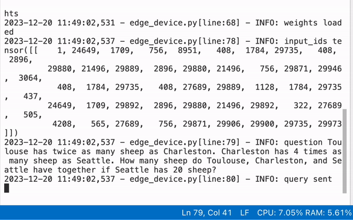

# PrivateLoRA Demo

This demo aims to show the advantages in data locality, throughput and personalization when using PrivateLoRA.

The simulated scenario is that
a user of edge device, with very limited compute power, queries the model with a question of GSM8K. 
Thanks to PrivateLoRA, the following results are achieved:

1. Generation speed is 10 times faster than running on CPU.
2. Model outputs correct and detailed solutions.
3. Locality of user data and parameters are fully preserved.


## Usage

### 1.Download the weight

Ensure that you have both [LLaMA 2-7B weights](https://huggingface.co/meta-llama/Llama-2-7b) and [PrivateLoRA weights trained on GSM8K](https://huggingface.co/wanglamao/PrivateLoRA_GSM8K).

### 2.Prepare Weights
This step prepares weight dict for cloud model and device model.
Run the following command to prepare weights.
```bash
cd demo
python prepare_weights.py <llama_dir> <pl_path> <output_dir>
# python prepare_weights.py ./llama2-7b ./pl_gsm8k.bin weights/
```

In `<ouput_dir>`, weights for cloud and edge device are stored separately.

### 3.Launch Cloud and Device
Firstly, launch cloud model by
```python
python central_cloud.py <weight_path> <llama_path> [--ip 127.0.0.1] [--port 12345] [--debug False] 
# python central_cloud.py weights/cloud/pytorch-model.bin ./llama2-7b 
```
The script will firstly load model and then open tcp socket.

**After you see "model ready" in cloud terminal,** launch device model by

```python
python edge_device.py <weight_path> <llama_path> [--ip 127.0.0.1] [--port 12345] [--debug False] 
# python edge_device.py weights/device/pytorch-model.bin ./llama2-7b 
```

### Results

You should then see something like this.
<figure>

<figcaption style="text-align: center;">Screenshots of Edge Device running on CPU.</figcaption>
</figure>


### Limitations and Improvement

This demo demonstrates the good adaptation performance and extremely reduced communication overhead of PrivateLoRA.
Although the throughput(~3tps) is almost 10 times faster than CPU(~0.3tps), it is not as impressive as estimated in our paper(~24tps). 

The primary reason is that Python is slow.
The I/O operations become the performance bottleneck after we reduce over 95% of network communication.
Also, Python GIL executes PrivateLoRA and Q,K,V in series which is designed to be parallel. 

Therefore, we are implementing another demo based on projects like llama.cpp to fully realize the potential of PrivateLoRA. Stay tuned.